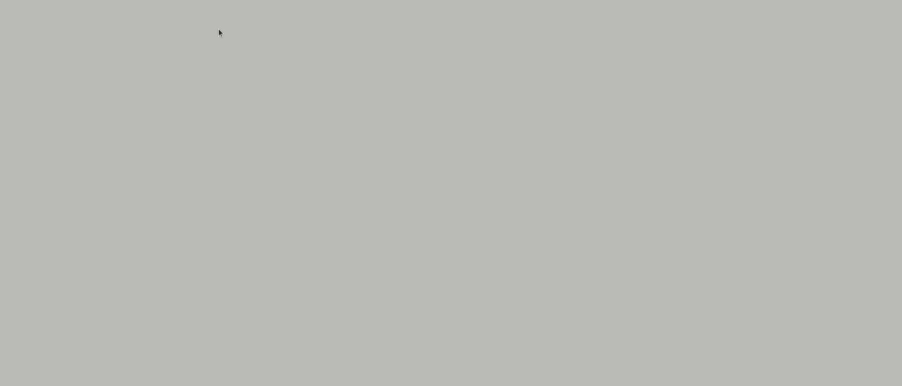

# Screen Dots

<h1 align="center">
   
</h1>

<div align="center">
   <a href="#desktop_computer-project">
      
   </a>
   <a href="#technologist-technologies">
      
   </a>
   <a href="#clipboard-how-to-use">
      
   </a>
   <a href="#speech_balloon-contact">
      
   </a>
</div>
<br>

## :desktop_computer: Project

Screen Dots is a small application that renders elements on the screen according to where they are clicked, allowing you to undo and redo steps.

## :technologist: Technologies Used

- React
- TypeScript
- Phosphor React
- Styled Components

## :clipboard: How to Use

To get a local copy of the project up and running, follow these steps.

### Installation

1. **Clone the repository**:

```bash
   git clone https://github.com/JhonatanGAlves/screen-dots.git
   cd screen-dots
```

2. **Install dependencies:**:

```bash
   yarn
```

4. **Start the application:**

```bash
   yarn dev
```

## :speech_balloon: Contact

<br>
<div align="center">
   <a href="https://jhonatandev-alves-app.vercel.app/" target="_blank">
      
   </a>
   <a href="https://www.linkedin.com/in/jhonatan-alves-11b28015b/" target="_blank">
      
   </a>
   <a href="mailto:jhonatan.galves1996@gmail.com">
      
   </a>
</div>
